# Distributed Fuzzing Platform

## Назначение

Платформа управляет distributed fuzzing-кампаниями, их сборками, выполнением, corpus, coverage и findings через единый Control Plane.

## Как система получает и выделяет ресурсы

### Уровень 1. Архитектура

```mermaid
flowchart LR
    actor["Пользователь / CI"]
    api["API<br/>проверка доступа и команды"]
    state[("Authoritative state<br/>desired state + resource policy")]
    rec["Reconciler<br/>создаёт FuzzJob или Task"]
    sched["Domain Scheduler<br/>разрешает претендовать<br/>на выполнение"]
    admission["Resource Admission<br/>quotas · priority · fair sharing<br/>preemption"]
    lease["ResourceLease<br/>ограниченное по времени<br/>разрешение"]
    backend["Execution Backend<br/>создаёт и наблюдает ресурс"]
    resource["Физический workload<br/>и его ExecutionAttempt"]

    actor -->|"Campaign / Task<br/>и требования к ресурсам"| api
    api -->|"атомарно сохраняет intent<br/>и durable event"| state
    state --> rec
    rec -->|"resource request<br/>от FuzzJob или Task"| sched
    sched --> admission
    admission -->|"admit"| lease
    admission -.->|"нет квоты / capacity:<br/>остаётся в очереди"| sched
    lease -->|"только с действующим lease"| backend
    backend --> resource
    resource -->|"observations / terminal result"| backend
    backend -->|"обновление observed state"| state
```

Главное в этой схеме:

1. Запрос на ресурсы появляется не в Kubernetes. Его создаёт reconciler для готового к запуску `FuzzJob` или `Task` на основании сохранённого пользовательского intent и resource policy.
2. `Domain Scheduler` решает, **можно ли этой работе претендовать на запуск**.
3. `Resource Admission` проверяет quotas, priority, fair sharing и preemption и выдаёт собственный объект платформы — `ResourceLease`.
4. Только после выдачи действующего lease `Execution Backend` создаёт физический ресурс. Сам backend выбирает размещение, но не определяет lifecycle Campaign, FuzzJob или Task.
5. При потере ресурса история `ExecutionAttempt` сохраняется. Повторный запуск требует нового lease и новой попытки.

### Уровень 2. Предлагаемая реализация

Легенда: **жёлтый — реализуем в платформе**, **синий — реализуем адаптер**, **зелёный — берём готовый компонент**, **серый — технологический выбор ещё открыт**.

```mermaid
flowchart LR
    client["Пользователь / CI"]

    subgraph cp["Control Plane — собственная логика платформы"]
        api["API + authorization"]
        domain["Domain model + state machines"]
        reconciler["Reconcilers + Domain Scheduler"]
        lease["ResourceLease + admission gate"]
    end

    persistence[("Persistence + transactional outbox<br/>конкретный продукт не выбран")]
    kadapter["Собственный<br/>Kueue adapter"]
    kueue["Kueue<br/>quota · queue · fair sharing<br/>preemption"]
    eadapter["Собственный Kubernetes adapter<br/>ExecutionBackend / TaskExecutor"]
    k8s["Kubernetes<br/>scheduler · Pod · Job"]
    workload["FuzzJob: Pod<br/>Task: Job → Pod"]

    client --> api
    api --> domain
    domain <-->|"authoritative state<br/>и события"| persistence
    domain --> reconciler
    reconciler -->|"resource request"| kadapter
    kadapter -->|"Workload / queue mapping"| kueue
    kueue -->|"admission observation"| kadapter
    kadapter -->|"сохранить ACTIVE lease"| lease
    lease -->|"разрешить start"| eadapter
    eadapter --> k8s
    k8s --> workload
    workload -->|"status / UID / outputs"| eadapter
    eadapter -->|"observed state"| domain

    class api,domain,reconciler,lease custom;
    class kadapter,eadapter adapter;
    class kueue,k8s ready;
    class persistence open;

    classDef custom fill:#fff2cc,stroke:#b58b00,color:#111;
    classDef adapter fill:#dae8fc,stroke:#3975a6,color:#111;
    classDef ready fill:#d5e8d4,stroke:#4f8a4f,color:#111;
    classDef open fill:#eeeeee,stroke:#777,color:#111;
```

Kueue и Kubernetes не заменяют Control Plane. Kueue сообщает результат admission, после чего адаптер сохраняет нормативный `ResourceLease`. Kubernetes исполняет workload, а его Pod/Job UID хранится только как opaque `BackendResourceRef` конкретного `ExecutionAttempt`.

Все указанные ниже интеграции пока имеют статус `PROPOSED`: готовый продукт можно переиспользовать только после целевого PoC, проверки лицензии и фиксации решения в ADR.

| Область | Что реализуем сами | Что берём готовым |
|---|---|---|
| Управление системой | Domain model, lifecycle, API, authorization, reconcilers, `Domain Scheduler` | — |
| Выделение ресурсов | `ResourceLease`, admission gate, отображение tenant/project policy и собственный `ResourceAdmission` adapter | Kueue как кандидат для queues, quotas, fair sharing и preemption |
| Физическое исполнение | `ExecutionBackend`/`TaskExecutor` adapters, operation keys, mapping `ExecutionAttempt ↔ Pod UID`, fencing и сбор результатов | Kubernetes Pod/Job и scheduler; controller-runtime только внутри adapter |
| Сборка | Lifecycle `Build`, fingerprint, provenance, cache policy и `BuildExecutor` adapter | OSS-Fuzz и BuildKit как кандидаты внутри adapter |
| Artifacts и corpus | Собственные `ArtifactStore`/`CorpusStore` interfaces, tenant authorization, immutable manifests и canonical CAS | Go CDK `blob` или native provider SDK после parity PoC |
| Findings | Immutable occurrence/report history, versioned dedup policy и adapters | CASR как кандидат для parsing и normalization |
| Coverage | Coverage compatibility, epochs, active-time accounting и собственный normalizer | Fuzzer-specific tools только за adapter boundary |
| Identity и audit | Tenant/project policy, audit contract и append-only adapter | OIDC provider и WORM/persistence product ещё не выбраны |
| Изоляция | Выбор обязательного isolation profile и проверка capabilities до запуска | Kubernetes controls для MVP; gVisor/Kata — кандидаты последующих этапов |

Короткое правило для выбора границы: **готовые компоненты предоставляют инфраструктурные механизмы, а платформа реализует domain-смысл, состояние, политики и адаптацию этих механизмов к своим контрактам**.

## Статус проекта

Документация фиксирует architecture-first основу проекта. `Architecture.md` является нормативным документом; `Implementation.md` описывает варианты реализации и их соответствие архитектурным контрактам.

## Документация

- [Architecture.md](Architecture.md) — нормативная архитектура, domain model, lifecycle, инварианты, порты и требования безопасности.
- [Implementation.md](Implementation.md) — ненормативное отображение архитектуры на технологии и операционные ограничения.
- [docs/adr/](docs/adr/) — записи значимых технологических решений и правила их оформления.
- [design spec](docs/superpowers/specs/2026-09-17-architecture-first-documentation-design.md) — согласованный дизайн реструктуризации документации.

Архитектура нормативна: реализация не может изменять архитектурные инварианты и обязана либо соответствовать им, либо инициировать отдельное изменение архитектуры.

## Порядок принятия решений

Сначала проверяются domain model, lifecycle, инварианты и контракты в `Architecture.md`. Затем технологический выбор описывается в `Implementation.md`, а значимые решения по реализации портов фиксируются отдельными ADR в [docs/adr/](docs/adr/). ADR не меняет архитектурные инварианты.
