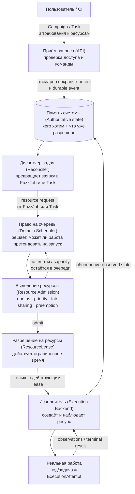
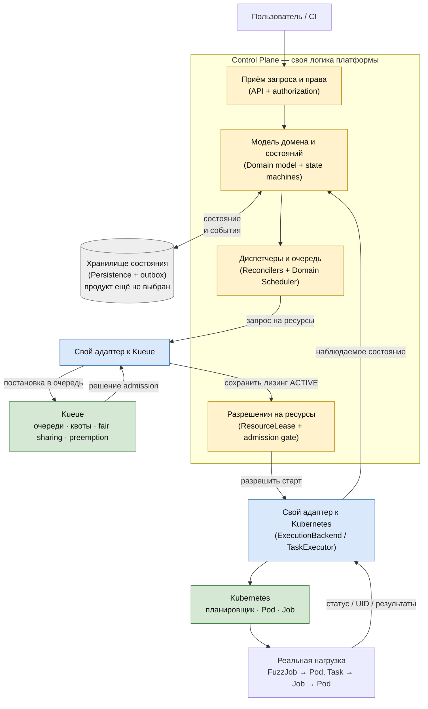

# Distributed Fuzzing Platform

## Назначение

Платформа управляет distributed fuzzing-кампаниями, их сборками, выполнением, corpus, coverage и findings через единый Control Plane.

## Частые вопросы

**1. Как подразумевается запускать фаззинг: какая гранулярность, какой результат, какие сценарии применения?**
Единица запуска, которую видит пользователь, — `Campaign`: инженер или CI указывают набор targets на конкретной source revision. Сборка (`Build`) — на уровне `Project`: один build под конкретную revision и recipe переиспользуется для всех targets и Campaign, которым он подходит (cache hit не создаёт новый build). Внутри Campaign каждый target — это независимый continuous `FuzzJob`; над ним по требованию запускаются отдельные `Task` (reproduce, minimize, corpus merge, regression-проверка). Результат — не один статус, а три независимых потока: coverage-прогресс, corpus (накопленные интересные входные данные) и дедуплицированные `Finding` после разбора и triage крашей. Сценарии: разовый прогон при код-ревью, continuous fuzzing основной ветки, regression/fix-verification после исправления бага, периодическая чистка corpus по политике.

**2. В чём смысл проекта, если есть ClusterFuzz / ClusterFuzzLite?**
Мы переиспользуем их отдельные механики как reference (например, CASR для разбора крашей, OSS-Fuzz runner contract для запуска движков — см. таблицу в разделе «Предлагаемая реализация»), но не берём их как ядро платформы. ClusterFuzz исторически построен под операционную модель и инфраструктурные допущения Google и не даёт из коробки multi-tenant изоляцию, управление ресурсами через квоты/lease и audit trail поверх произвольного Kubernetes-кластера — а это то, ради чего затевается собственный Control Plane.

**3. Какой применяется стек и зачем?**
Полный список — в таблице раздела «Предлагаемая реализация». Коротко: Kubernetes исполняет реальные Pod/Job, Kueue — кандидат на quotas/fair-sharing/preemption вместо своего шедулера ресурсов, OSS-Fuzz-совместимый runner и BuildKit — чтобы переиспользовать существующую экосистему движков и сборок, CASR — кандидат на разбор крашей вместо своего парсера. Для долгосрочного хранения artifacts/corpus конкретный provider (S3-совместимое хранилище, Artifactory и т.п.) ещё не выбран — это открытый интерфейс (`ArtifactStore`/`CorpusStore`), решение фиксируется отдельным ADR после PoC.

**4. Как в двух словах оценивается необходимый ресурс — на уровне Campaign или Job?**
Схема resource policy (лимиты, приоритет) задаётся при создании `Campaign` как единый объект; можно ли внутри него указать разные лимиты на разные targets — открытый вопрос API/схемы, архитектура это не фиксирует. Но гарантировано архитектурно другое: сам resource request и `ResourceLease` формируются и живут отдельно для каждого `FuzzJob`/`Task`, а не одним общим lease на всю Campaign — поэтому admission и preemption одного target не связаны с остальными targets той же Campaign.

Откуда берётся сама величина запроса (сколько именно CPU/RAM) — предложенный (`PROPOSED`, ещё не проверен) подход: target объявляет в репозитории закрытый resource-профиль (`small`/`standard`/`large`), а `Resource Admission` клэмпит его по tenant policy до отправки в Kueue — по аналогии с Kubernetes `LimitRange`/`ResourceQuota`. Подробнее — `Implementation.md`, §8.

**5. До какого уровня гранулярности Control Plane позволит отслеживать/управлять фаззингом?**
Полная цепочка: `Campaign → FuzzJob → Task → ExecutionAttempt`. Pause/stop/resume можно применять на уровне Campaign (каскадно) или отдельного FuzzJob. У каждого `ExecutionAttempt` — своя история и причина завершения (успех/потеря/отмена/preemption), а не только агрегированный статус кампании. Отдельно отслеживаются coverage epochs, corpus snapshots и путь каждого краша `FindingOccurrence → CrashReport → Finding`, включая то, какая именно попытка его нашла.

## Как система получает и выделяет ресурсы

### Уровень 1. Архитектура



**Простыми словами:** пользователь оформляет заявку на fuzzing. Система сначала просто запоминает, чего он хочет, и только потом проверяет — может ли эта работа вообще претендовать на запуск, хватает ли ресурсов и не превышена ли квота. Реальный под в кластере создаётся только после явного разрешения (lease), которое действует ограниченное время. Если ресурс пропал по дороге — история не переписывается: система честно фиксирует это и запускает новую попытку с новым разрешением.

Главное в этой схеме:

1. Запрос на ресурсы появляется не в Kubernetes. Его создаёт «Диспетчер задач» (Reconciler) для готового к запуску `FuzzJob` или `Task` на основании сохранённого пользовательского intent и resource policy.
2. «Право на очередь» (Domain Scheduler) решает, **можно ли этой работе претендовать на запуск**.
3. «Выделение ресурсов» (Resource Admission) проверяет quotas, priority, fair sharing и preemption и выдаёт собственный объект платформы — «Разрешение на ресурсы» (ResourceLease).
4. Только после выдачи действующего lease «Исполнитель» (Execution Backend) создаёт физический ресурс. Сам backend выбирает размещение, но не определяет lifecycle Campaign, FuzzJob или Task.
5. При потере ресурса история `ExecutionAttempt` сохраняется. Повторный запуск требует нового lease и новой попытки.

### Уровень 2. Предлагаемая реализация

Легенда: **жёлтый — реализуем в платформе**, **синий — реализуем адаптер**, **зелёный — берём готовый компонент**, **серый — технологический выбор ещё открыт**.



**Простыми словами:** Kueue и Kubernetes ничего не решают за платформу — это просто механизмы, которыми управляет наша логика. Kueue отвечает только за очередь и квоты, Kubernetes — только за то, чтобы реально поднять под. А вот что считать кампанией, что — разрешением на ресурсы и что — успехом или провалом, платформа решает и хранит сама, а не в Kubernetes.

Kueue и Kubernetes не заменяют Control Plane. Kueue сообщает результат admission, после чего адаптер сохраняет нормативный `ResourceLease`. Kubernetes исполняет workload, а его Pod/Job UID хранится только как opaque `BackendResourceRef` конкретного `ExecutionAttempt`.

Все указанные ниже интеграции пока имеют статус `PROPOSED`: готовый продукт можно переиспользовать только после целевого PoC, проверки лицензии и фиксации решения в ADR.

| Область | Что реализуем сами | Что берём готовым |
|---|---|---|
| Управление системой | Domain model, lifecycle, API, authorization, reconcilers, `Domain Scheduler` | — |
| Выделение ресурсов | `ResourceLease`, admission gate, отображение tenant/project policy и собственный `ResourceAdmission` adapter | Kueue как кандидат для queues, quotas, fair sharing и preemption |
| Физическое исполнение | `ExecutionBackend`/`TaskExecutor` adapters, operation keys, mapping `ExecutionAttempt ↔ Pod UID`, fencing и сбор результатов | Kubernetes Pod/Job и scheduler; controller-runtime только внутри adapter |
| Сборка | Lifecycle `Build`, fingerprint, provenance, cache policy и `BuildExecutor` adapter | OSS-Fuzz и BuildKit как кандидаты внутри adapter |
| Artifacts и corpus | Собственные `ArtifactStore`/`CorpusStore` interfaces, tenant authorization, immutable manifests и canonical CAS | Go CDK `blob` или native provider SDK после parity PoC |
| Findings | Immutable occurrence/report history, versioned dedup policy и adapters | CASR как кандидат для parsing и normalization |
| Coverage | Coverage compatibility, epochs, active-time accounting и собственный normalizer | Fuzzer-specific tools только за adapter boundary |
| Identity и audit | Tenant/project policy, audit contract и append-only adapter | OIDC provider и WORM/persistence product ещё не выбраны |
| Изоляция | Выбор обязательного isolation profile и проверка capabilities до запуска | Kubernetes controls для MVP; gVisor/Kata — кандидаты последующих этапов |

Короткое правило для выбора границы: **готовые компоненты предоставляют инфраструктурные механизмы, а платформа реализует domain-смысл, состояние, политики и адаптацию этих механизмов к своим контрактам**.

### Уровень 3. Пошагово: как выделяется конкретный ресурс

Пример: нужно профаззить target X, платформа посчитала, что для этого нужно N ресурсов (CPU/память).

```mermaid
sequenceDiagram
    participant P as Платформа (Control Plane)
    participant Q as Kueue
    participant K as Kubernetes

    Note over P: Reconciler посчитал:<br/>target X требует N ресурсов
    P->>K: Создать Pod со scheduling gate<br/>("пока не трогать")
    P->>Q: Зарегистрировать Workload<br/>на N ресурсов в очереди tenant
    Note over Q: Kueue проверяет квоту,<br/>capacity и приоритет;<br/>может вытеснить менее<br/>приоритетную работу
    Q->>K: Снять scheduling gate<br/>(место найдено)
    Note over K: Только теперь штатный<br/>Kubernetes-планировщик<br/>выбирает ноду и запускает под
    K-->>P: Pod запущен (UID)
    Q-->>P: admission подтверждён
    Note over P: Сохраняем ResourceLease (ACTIVE)<br/>и ExecutionAttempt (RUNNING)
```

**Что такое scheduling gate:** это штатный механизм Kubernetes (`Pod.spec.schedulingGates`) — на под при создании вешается одна или несколько именованных «задвижек». Пока хоть одна висит, штатный планировщик Kubernetes вообще не смотрит на этот под, как будто его не существует для целей планирования, хотя сам объект Pod уже создан и виден в кластере. Снять задвижку может только тот, кто её повесил — в этой схеме это Kueue, когда подтвердил, что ресурсы есть. Как только последняя задвижка снята, под становится обычным «ждёт планирования», и дальше ноду выбирает уже стандартный Kubernetes-планировщик; Kueue в это не вмешивается.

Зачем нужен именно такой трюк, а не просто "подождать и потом создать под": так Kueue считает capacity по *настоящему* объекту Pod (а не по отдельной абстрактной заявке), но при этом гарантированно не даёт планировщику случайно запустить его раньше, чем реально выделены ресурсы.

**Как это встраивается в уже существующий кластер:**

- **Kueue — отдельный компонент**, который администратор кластера ставит один раз сам, отдельно от платформы (свой controller и свои CRD: `ClusterQueue`, `LocalQueue`, `ResourceFlavor`, `Workload`). Платформа его не разворачивает — она только клиент этого API.
- **Control Plane платформы — обычный сервис**, а не Kubernetes-оператор и не набор собственных CRD. Он хранит свою модель домена (`Campaign`, `FuzzJob`, `ResourceLease` и т.д.) в своей базе данных, а с кластером говорит только через один компонент — Kubernetes-адаптер (`Execution Backend` + `Resource Admission` adapter).
- Этому адаптеру нужен **service account с ограниченным RBAC**: право создавать и наблюдать Pod, Job и Kueue `Workload` в выделенных namespace (обычно свой namespace на tenant/project — это и есть требование изоляции).
- Кроме установки Kueue и выдачи прав этому service account, никаких изменений в существующий кластер не требуется — платформа не трогает остальные workload'ы кластера.

## Статус проекта

Документация фиксирует architecture-first основу проекта. `Architecture.md` является нормативным документом; `Implementation.md` описывает варианты реализации и их соответствие архитектурным контрактам.

## Документация

- [Architecture.md](Architecture.md) — нормативная архитектура, domain model, lifecycle, инварианты, порты и требования безопасности.
- [Implementation.md](Implementation.md) — ненормативное отображение архитектуры на технологии и операционные ограничения.
- [docs/adr/](docs/adr/) — записи значимых технологических решений и правила их оформления.
- [design spec](docs/superpowers/specs/2026-09-17-architecture-first-documentation-design.md) — согласованный дизайн реструктуризации документации.

Архитектура нормативна: реализация не может изменять архитектурные инварианты и обязана либо соответствовать им, либо инициировать отдельное изменение архитектуры.

## Порядок принятия решений

Сначала проверяются domain model, lifecycle, инварианты и контракты в `Architecture.md`. Затем технологический выбор описывается в `Implementation.md`, а значимые решения по реализации портов фиксируются отдельными ADR в [docs/adr/](docs/adr/). ADR не меняет архитектурные инварианты.
